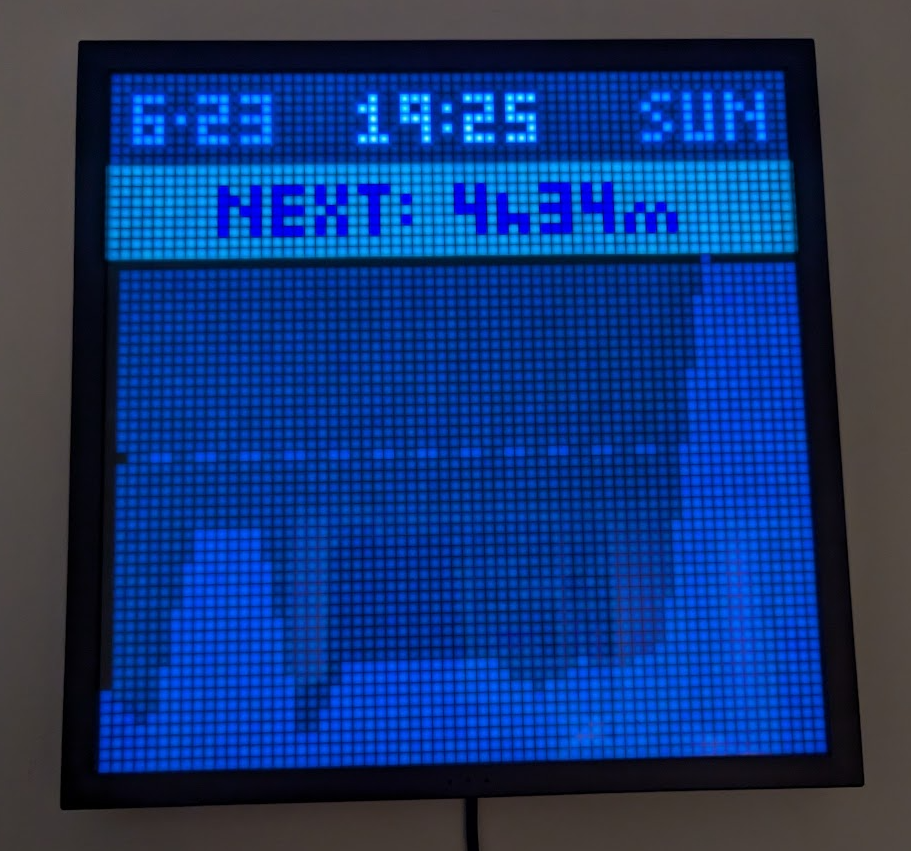

# aon - pixoo example

This code is from a larger personal project that includes a pixoo
dashboard for displaying a countdown clock to my next meeting in google
calendar (along with coloured 5 and 2 minute warnings), as well as
some financial data I graph from [ledger-cli](https://ledger-cli.org/) content.

This code doesn't run by itself.  I'm just sharing it for others to
learn from.

Licensed under the terms of the MIT license.

AG
